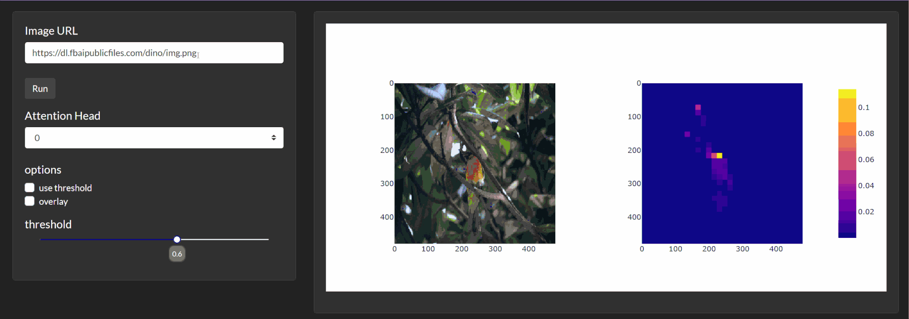

# Dash DINO

This is a demo of [Facebook AI's DINO](https://github.com/facebookresearch/dino) model, built using [Dash Labs](https://github.com/plotly/dash-labs).



Using Dash Labs, you can build apps without specifying a layout. This app was built using this single function:

```python
@app.callback(
    args=dict(
        url=tpl.textbox_input(default_url, label="Image URL", kind=dl.State),
        run=tpl.button_input("Run", label=""),
        head=tpl.dropdown_input(list(range(6)), value="0", label="Attention Head"),
        options=tpl.checklist_input(["use threshold", "overlay"], []),
        threshold=tpl.slider_input(0, 1, 0.6, 0.01),
    ),
    output=tpl.graph_output(),
    template=tpl,
)
def callback(url, run, threshold, head, options):
    try:
        im = download_img(url)
    except:
        return go.Figure().update_layout(title="Incorrect URL")

    ix = int(head)
    # Run model
    img = transform(im).to(device)
    attentions, w_featmap, h_featmap = predict(img)
    th_attn, scalar_attn = apply_threshold(attentions, w_featmap, h_featmap, threshold)

    attns = th_attn if "use threshold" in options else scalar_attn

    if "overlay" in options:
        fig = px.imshow(im)
        fig.add_trace(go.Heatmap(z=attns[ix], opacity=0.55))
    else:
        fig = make_subplots(1, 2)
        fig.add_trace(go.Image(z=im), 1, 1)
        fig.add_trace(go.Heatmap(z=attns[ix]), 1, 2)
        fig.update_xaxes(matches="x")
        fig.update_yaxes(matches="y")

    return fig
```

The entire layout was built from the args specified in the `app.callback` thanks to [templates](https://community.plotly.com/t/introducing-dash-labs-dash-2-0-preview/52087).
